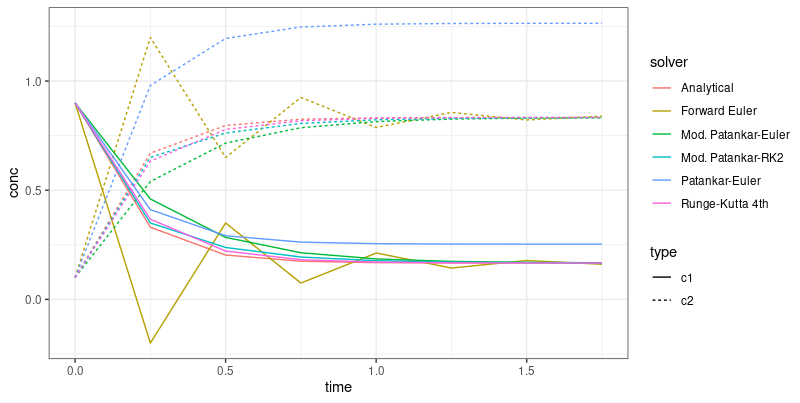

# Numerical schemes for ODEs

Non-negative and conservative discretisations are needed for water quality modeling. Most numerical schemes are neither. [Burchard, Deleersnijder and Meister](https://www.sciencedirect.com/science/article/pii/S0168927403001016) highlighted the implementation of high-order conservative Patankar-type discretisations to water quality ODEs. This repository includes code to replicate their findings in R for the simple linear model test case:

```{r gh-installation, eval = FALSE}
# dc1/dt = c2 - a c1
# dc2/dt = a c1 - c2
```

Code for forward Euler, Runge-Kutta 4th order, Patankar-Euler, modified Patankar-Euler and modified Patankar Runge-Kutta 2nd order are provided.


<a href="url"></a> 

Thanks to Illviljan who provided Python code on the [scipy repo](https://www.google.com/url?q=https://github.com/scipy/scipy/issues/12766&source=gmail&ust=1668179153456000&usg=AOvVaw1pcFVTnn_7VWccx5UFKYD3).
